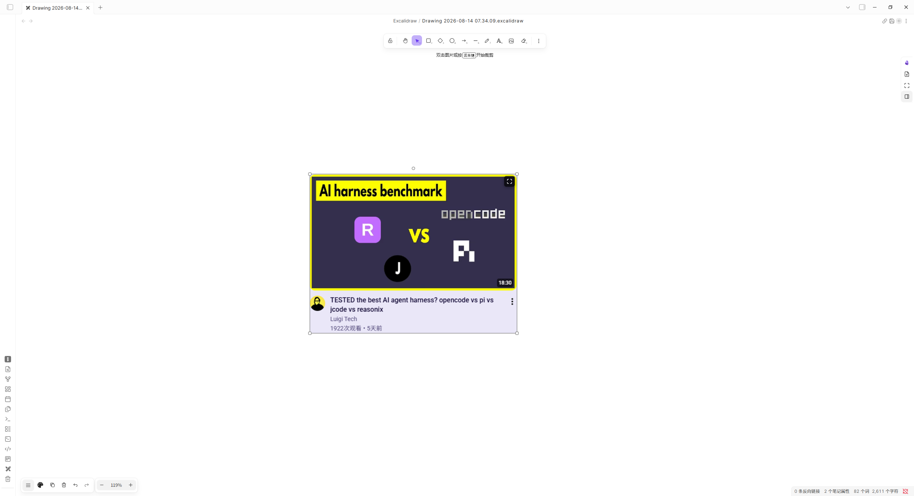
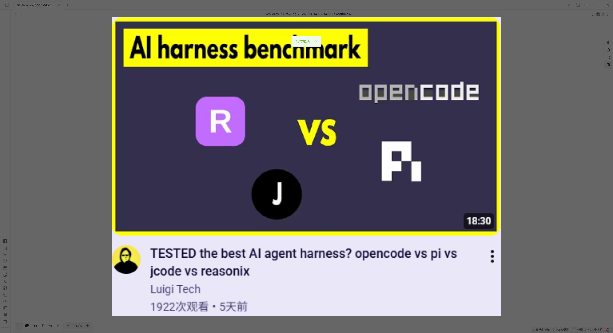
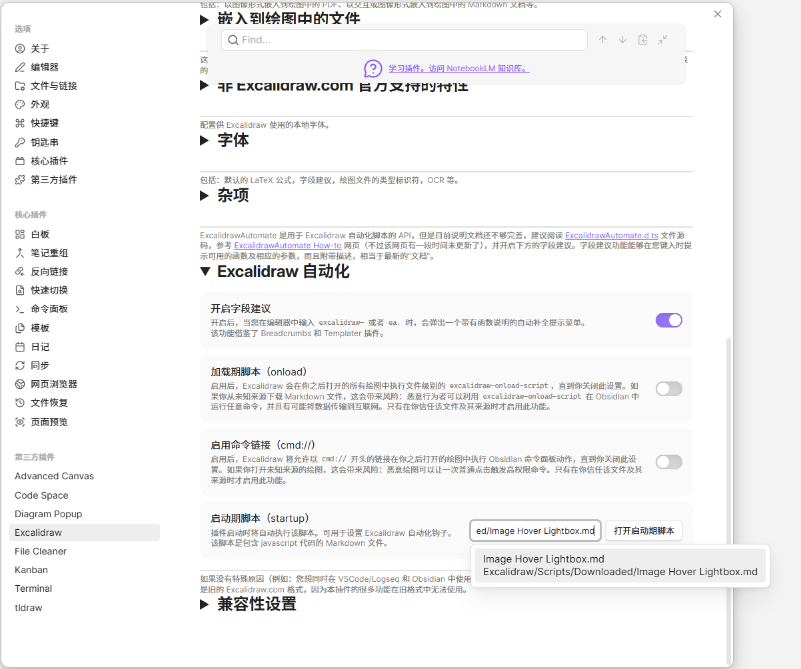

# Image Hover Lightbox · 图片悬停放大

> Part of **[Otto OBplugins](https://github.com/otto-OBplugins)** · Excalidraw script series  
> **版本 `1.1.0`** · [CHANGELOG](./CHANGELOG.md) · [维护说明](./MAINTAINING.md)
> 安装目录：[excalidraw-scripts-catalog](https://github.com/otto-OBplugins/excalidraw-scripts-catalog)

在 Obsidian Excalidraw 画布中：

1. **悬停**图片元素 → 右上角出现**全屏四角**按钮  
2. **点击按钮**（不是点图片本体）→ 打开遮罩层大图  
3. **点遮罩空白**或 **Esc** 关闭  

不拦截图片的选中 / 拖动。



---

## 一键安装（推荐）

在任意 Obsidian 笔记中粘贴：

````md
```excalidraw-script-install
https://raw.githubusercontent.com/otto-OBplugins/excalidraw-image-hover-lightbox/main/scripts/Image%20Hover%20Lightbox.md
```
````

或从系列目录安装全部脚本（见 [excalidraw-scripts-catalog](https://github.com/otto-OBplugins/excalidraw-scripts-catalog)）：

````md
```excalidraw-script-install
https://raw.githubusercontent.com/otto-OBplugins/excalidraw-scripts-catalog/main/README.md
```
````

安装后任选其一启用：

1. **自动加载（推荐）**：Excalidraw 设置 → **Startup Script** → 选择 `Excalidraw/Scripts/Downloaded/Image Hover Lightbox.md`
2. **手动**：打开画布 → 运行 **Image Hover Lightbox** 一次  



图中的“加载期脚本（onload）”可以保持关闭。本脚本使用的是“启动期脚本（startup）”，两者不是同一项设置。

> 官方入口是自包含脚本。首次运行不要求访问 GitHub raw，也不下载或动态执行远程模块；只安装该脚本和同名 SVG 即可运行。

启动脚本会等待 `ExcalidrawAutomate` 就绪，轮询间隔 250ms，最长等待 30 秒。配置一次 Startup Script 后，打开 Excalidraw 画布即可自动挂载，不需要每次重新运行脚本。

### 重新安装后的自动启用

- 只禁用再启用 Excalidraw 插件：通常会保留 Startup Script 配置。
- 卸载并重新安装 Excalidraw 插件：请重新打开 Excalidraw 设置，确认 **Startup Script** 仍指向本脚本；如果配置为空或路径失效，请重新选择脚本文件。
- Excalidraw 一键安装器通常将脚本放在 `Excalidraw/Scripts/Downloaded/Image Hover Lightbox.md`。手动安装时也可以使用 `Excalidraw/Scripts/`，请以你自己的 vault 中脚本实际位置为准。
- 重新安装本脚本：只要脚本路径没有变化，通常无需再次配置 Startup Script。
- 修改 Startup Script 后，请完整退出并重新启动 Obsidian，让 Excalidraw 重新读取配置。
- `enableOnloadScripts` 与 **Startup Script** 是两项不同设置。本脚本使用 Startup Script，不需要额外开启 `enableOnloadScripts`。

工作区恢复已打开标签时，`onFileOpenHook` 可能不会触发；脚本会在每次恢复轮询中让 `ExcalidrawAutomate.setView("active")` 重新选择当前活动绘图，再对确认存在且已加载的视图做延迟兜底。

悬停入口尺寸固定为：按钮容器 **30×30 CSS px**，SVG 图标 **16×16 CSS px**。按钮使用 Flex 居中，图标右上角距离图片边缘 6px。

---

## 手动安装

1. 复制 `Module/*.js` 到 vault 的 `Excalidraw/Module/otto-OBplugins/image-hover-lightbox/`（仅手动开发或后备命令需要）
2. 复制 `scripts/Image Hover Lightbox.md` + `.svg` 到 `Excalidraw/Scripts/`（如果使用 Excalidraw 一键安装器，实际目录通常是 `Excalidraw/Scripts/Downloaded/`）
3. 配置 Startup Script，或在画布中运行脚本一次  
4. （可选）复制 `scripts/Image Hover Lightbox Command.md`，供选中小图后手动打开预览

---

## 仓库结构

```
Module/                 # 可测纯逻辑 + 绑定层
  geometry.js
  lightbox.js
  hoverEntry.js
  eaBindings.js
  globalMount.js
  viewEa.js
scripts/
  Image Hover Lightbox.md   # 脚本入口（可 install）
  Image Hover Lightbox Command.md # 可选后备命令
  Image Hover Lightbox.svg  # 工具栏图标
```

---

## 开发

源码开发与测试仍可在本地业务仓进行。本仓库为 **发布用独立项目**。

本地单测（开发仓 `obsidian-scripts`）：

```bash
node --test
```

入口会为每个 Excalidraw 叶子独立维护稳定 EA、绑定、按钮、监听器和刷新计时器；关闭叶子时只清理该叶子。按钮和遮罩按 view 的 `ownerDocument` / `ownerWindow` 归属，预览期间入口会隐藏，图片对象 URL 在关闭、替换或加载失败时释放。Popout 仍需在实际 Vault 中验证。

---

## 隐私与敏感信息

- 本仓库 **不包含** 个人 vault 路径、笔记内容、token。  
- 请勿提交本机绝对路径或私有 vault 配置。  

---

## License

MIT · Author: [ottopan](https://github.com/ottopan) / org [otto-OBplugins](https://github.com/otto-OBplugins)
